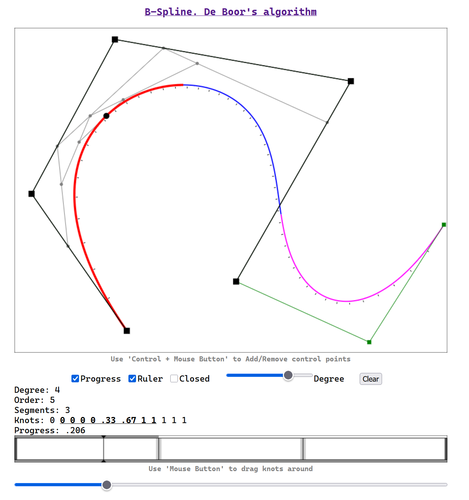
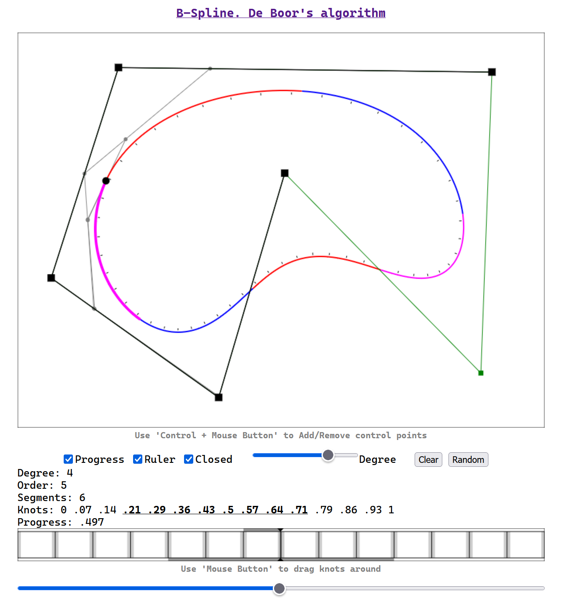

# B-Spline Visualizator

B-Spline curve visualization tool implementing [**De Boor's algorithm**](https://en.wikipedia.org/wiki/De_Boor%27s_algorithm).

## [Live demo](https://putyavka.github.io/bspline/dist/)

#### Clamped curve sample


#### Closed curve sample


## Features

- **Interactive Control Points**: Add/remove control points with Ctrl+Click
- **Dynamic Curve Generation**: Real-time B-spline curve rendering
- **Knot Editor**: Drag knots to modify curve behavior
- **Configurable Parameters**:
  - Adjustable degree (1-5)
  - Closed/open curve modes
  - Progress indicator with guides
  - Curve ruler for tangent visualization
- **Persistent Storage**: Control points saved to browser localStorage

## Usage

### Controls

| Action | Description |
|--------|-------------|
| **Ctrl + Click** | Add control point |
| **Ctrl + Click (existing point)** | Remove control point |
| **Drag knots** | Modify curve in knots editor |
| **Progress slider** | Visualize curve traversal with guides |

### Interface

- **Degree**: Set B-spline degree (affects curve smoothness)
- **Closed**: Toggle between open and closed curves
- **Ruler**: Show tangent guides along the curve
- **Clear**: Remove all control points

## Building

```sh
npm install
npm run build
```

The build process:
1. Compiles TypeScript to JavaScript
2. Bundles with Browserify
3. Copies `src/index.html` to dist and cleans up temporary files
